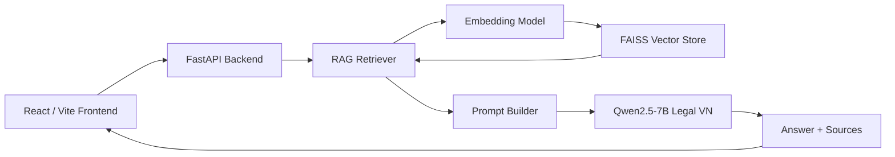

# ⚖️ PLDC Chatbot — Chatbot Pháp luật đại cương

Chatbot hỗ trợ học tập môn **Pháp luật đại cương**, sử dụng **Retrieval-Augmented Generation (RAG)** kết hợp mô hình ngôn ngữ pháp lý tiếng Việt.

Hệ thống truy xuất nội dung liên quan từ bài giảng môn Pháp luật đại cương bằng **FAISS + Vietnamese Legal Embedding**, sau đó cung cấp context cho **Qwen2.5-7B Legal Vietnamese** để sinh câu trả lời.

## ✨ Chức năng

Chatbot hỗ trợ 4 dạng bài:

| Chế độ | ID | Mô tả |
|---|---|---|
| Nhận định | `nhan_dinh` | Xác định nhận định đúng/sai và giải thích |
| So sánh | `so_sanh` | So sánh hai khái niệm hoặc vấn đề pháp lý |
| Tình huống | `tinh_huong` | Phân tích tình huống pháp luật theo các yếu tố liên quan |
| Định nghĩa | `dinh_nghia` | Trình bày định nghĩa và nội dung của khái niệm |

Ngoài câu trả lời, frontend còn hiển thị:

- Nguồn tài liệu được RAG truy xuất
- Trang của tài liệu
- Đoạn văn bản tham khảo
- Retrieval/reranking score

---

## 🧠 Kiến trúc hệ thống



Luồng xử lý:

```text
Câu hỏi người dùng
        ↓
Embedding câu hỏi
        ↓
FAISS semantic search
        ↓
Rule-based reranking
        ↓
Top relevant chunks
        ↓
Prompt theo từng dạng bài
        ↓
Qwen2.5-7B-legal-vn
        ↓
Câu trả lời + nguồn tham khảo
```

---

## 🛠️ Công nghệ sử dụng

### Backend

- Python
- FastAPI
- Hugging Face Transformers
- PyTorch
- Sentence Transformers
- FAISS
- NumPy
- PyPDF
- BitsAndBytes (tùy chọn cho 4-bit quantization)

### AI Models

**LLM**

```text
bqbbao6/Qwen2.5-7B-legal-vn
```

Dùng để đọc context và sinh câu trả lời.

**Embedding Model**

```text
cyhapun/vn-legal-embedding-v1
```

Dùng để chuyển câu hỏi và các đoạn tài liệu thành vector phục vụ semantic retrieval.

### Frontend

- React 19
- TypeScript
- Vite
- Tailwind CSS
- React Markdown
- React Textarea Autosize

---

## 📁 Cấu trúc project

```text
PLDC_Chatbot/
│
├── backend/
│   ├── app/
│   │   ├── main.py
│   │   └── schemas.py
│   │
│   ├── core/
│   │   ├── config.py
│   │   └── llm.py
│   │
│   ├── prompts/
│   │   ├── base.py
│   │   ├── manager.py
│   │   ├── nhan_dinh.py
│   │   ├── so_sanh.py
│   │   ├── tinh_huong.py
│   │   └── dinh_nghia.py
│   │
│   ├── rag/
│   │   ├── embedder.py
│   │   ├── retriever.py
│   │   └── vector_store.py
│   │
│   ├── scripts/
│   │   └── ingest.py
│   │
│   ├── data/
│   │   └── vector_store/
│   │       ├── index.faiss
│   │       └── metadata.json
│   │
│   └── requirements.txt
│
├── data/
│   └── Bai-giang-Phap-luat-dai-cuong.pdf
│
├── frontend/
│   ├── src/
│   │   ├── api/
│   │   ├── components/
│   │   ├── hooks/
│   │   ├── pages/
│   │   ├── styles/
│   │   └── utils/
│   │
│   ├── package.json
│   └── vite.config.ts
│
├── .gitignore
└── README.md
```

> `backend/data/vector_store/` đang được `.gitignore`, vì vậy sau khi clone repository cần chạy lại quá trình ingest để tạo FAISS index.

---

# 🚀 Cài đặt

## 1. Clone repository

```bash
git clone https://github.com/pthanh635/PLDC_Chatbot.git
cd PLDC_Chatbot
```

---

## 2. Tạo Python virtual environment

### Windows PowerShell

```powershell
python -m venv .venv
.\.venv\Scripts\Activate.ps1
```

### Linux / macOS

```bash
python -m venv .venv
source .venv/bin/activate
```

---

## 3. Cài dependencies backend

```bash
pip install -r backend/requirements.txt
```

Nếu sử dụng GPU NVIDIA, cần đảm bảo phiên bản **PyTorch hỗ trợ CUDA** được cài đúng với môi trường máy.

Kiểm tra:

```bash
python -c "import torch; print(torch.__version__); print(torch.cuda.is_available())"
```

Khi GPU hoạt động, kết quả:

```text
True
```

### 4-bit quantization

Nếu muốn load model ở 4-bit:

```env
LOAD_IN_4BIT=true
```

thì cần `bitsandbytes` hoạt động cùng CUDA.

Trên một số môi trường Windows có thể cần cài `bitsandbytes` riêng thay vì dựa vào `requirements.txt`.

---

# ⚙️ Cấu hình môi trường

Tạo file:

```text
.env
```

ở thư mục root.

Ví dụ:

```env
MODEL_ID=bqbbao6/Qwen2.5-7B-legal-vn
EMBEDDING_MODEL_ID=cyhapun/vn-legal-embedding-v1

MOCK_LLM=false
LOAD_IN_4BIT=true
RAG_REQUIRED=true

MAX_NEW_TOKENS=900
TEMPERATURE=0.15
TOP_P=0.9
TOP_K=5

API_HOST=127.0.0.1
API_PORT=8000

CORS_ORIGINS=http://localhost:5173
```

### Các biến quan trọng

| Biến | Ý nghĩa |
|---|---|
| `MODEL_ID` | Model dùng để sinh câu trả lời |
| `EMBEDDING_MODEL_ID` | Model embedding dùng cho RAG |
| `MOCK_LLM` | `true` để chạy chế độ mock, `false` để dùng model thật |
| `LOAD_IN_4BIT` | Load LLM ở dạng 4-bit |
| `RAG_REQUIRED` | Yêu cầu vector store tồn tại trước khi chat |
| `MAX_NEW_TOKENS` | Số token tối đa model có thể sinh |
| `TEMPERATURE` | Độ ngẫu nhiên khi sinh |
| `TOP_P` | Nucleus sampling |
| `TOP_K` | Tham số generation |
| `CORS_ORIGINS` | Frontend được phép gọi API |

> `.env` được Git ignore và không được commit lên repository.

---

# 📚 Tạo RAG Vector Store

Repository có sẵn file:

```text
data/Bai-giang-Phap-luat-dai-cuong.pdf
```

Chạy từ thư mục root:

```bash
python -m backend.scripts.ingest --pdf "data/Bai-giang-Phap-luat-dai-cuong.pdf"
```

Mặc định:

```text
chunk size   = 400 words
overlap      = 80 words
```

Có thể thay đổi:

```bash
python -m backend.scripts.ingest \
    --pdf "data/Bai-giang-Phap-luat-dai-cuong.pdf" \
    --chunk-words 400 \
    --overlap-words 80
```

Pipeline ingest:

```text
PDF
 ↓
Extract text
 ↓
Sentence splitting
 ↓
Cross-page chunking
 ↓
cyhapun/vn-legal-embedding-v1
 ↓
L2 normalization
 ↓
FAISS IndexFlatIP
 ↓
index.faiss + metadata.json
```

Kết quả được tạo tại:

```text
backend/data/vector_store/
├── index.faiss
└── metadata.json
```

---

# ▶️ Chạy Backend

Tại thư mục root:

```bash
uvicorn backend.app.main:app
```

Backend mặc định:

```text
http://127.0.0.1:8000
```

Swagger API:

```text
http://127.0.0.1:8000/docs
```

Health check:

```text
GET http://127.0.0.1:8000/health
```

Ví dụ response:

```json
{
  "status": "ok",
  "mock_llm": false,
  "llm_loaded": true,
  "rag_ready": true,
  "model_id": "bqbbao6/Qwen2.5-7B-legal-vn",
  "embedding_model_id": "cyhapun/vn-legal-embedding-v1"
}
```

---

# 💻 Chạy Frontend

Mở terminal khác:

```bash
cd frontend
npm install
npm run dev
```

Frontend mặc định:

```text
http://localhost:5173
```

Frontend gọi API thông qua:

```env
VITE_API_BASE_URL=http://127.0.0.1:8000
```

Nếu cần, tạo:

```text
frontend/.env
```

với:

```env
VITE_API_BASE_URL=http://127.0.0.1:8000
```

---

# 🔌 API

## GET `/health`

Kiểm tra trạng thái backend, model và RAG.

---

## GET `/modes`

Trả về các chế độ chatbot hỗ trợ.

---

## POST `/chat`

### Request

```json
{
  "mode": "dinh_nghia",
  "question": "Pháp luật là gì?"
}
```

### Response

```json
{
  "mode": "dinh_nghia",
  "answer": "Nội dung câu trả lời...",
  "sources": [
    {
      "source": "Bai-giang-Phap-luat-dai-cuong",
      "page": "20",
      "score": 0.85,
      "text_preview": "..."
    }
  ],
  "mock": false
}
```

---

# 🧪 Ví dụ sử dụng

## Định nghĩa

```json
{
  "mode": "dinh_nghia",
  "question": "Pháp luật là gì?"
}
```

## Nhận định

```json
{
  "mode": "nhan_dinh",
  "question": "Mọi hành vi trái pháp luật đều là vi phạm pháp luật."
}
```

## So sánh

```json
{
  "mode": "so_sanh",
  "question": "So sánh vi phạm hành chính và vi phạm dân sự."
}
```

## Tình huống

```json
{
  "mode": "tinh_huong",
  "question": "Nam mượn laptop của Minh rồi tự ý bán laptop đó. Hãy phân tích cấu thành vi phạm pháp luật."
}
```

---

# 🔎 RAG Retrieval

Hệ thống không gửi toàn bộ bài giảng vào model.

Thay vào đó:

1. Câu hỏi được embedding.
2. FAISS tìm các chunk gần nhất.
3. Retriever thực hiện semantic retrieval và reranking.
4. Các chunk phù hợp nhất được đưa vào prompt.
5. Qwen sinh câu trả lời dựa trên context.
6. Frontend hiển thị các nguồn đã sử dụng.

Điều này giúp:

- Giảm lượng context không cần thiết
- Tăng khả năng truy xuất đúng phần bài giảng
- Cho phép hiển thị nguồn và trang tài liệu
- Hạn chế model trả lời ngoài nội dung được cung cấp

---

# 🧩 Prompt theo từng dạng bài

Project tách prompt thành các module riêng:

```text
backend/prompts/
├── nhan_dinh.py
├── so_sanh.py
├── tinh_huong.py
└── dinh_nghia.py
```

`manager.py` chọn instruction phù hợp với `mode` của request.

Nhờ vậy mỗi dạng bài có cách trình bày và yêu cầu xử lý riêng thay vì dùng một prompt chung cho mọi câu hỏi.

---

# 🖥️ Yêu cầu hệ thống

Để sử dụng LLM thật:

- Python 3.11+ được khuyến nghị
- GPU NVIDIA CUDA được khuyến nghị
- RAM đủ để load model và embedding model
- Dung lượng ổ đĩa đủ cho model Hugging Face cache

Nếu:

```env
LOAD_IN_4BIT=true
```

backend yêu cầu PyTorch phát hiện CUDA GPU.

Nếu chỉ muốn kiểm tra API/frontend mà chưa load model thật:

```env
MOCK_LLM=true
```

---

# ⚠️ Lưu ý

Project được xây dựng phục vụ **học tập môn Pháp luật đại cương**.

Câu trả lời của mô hình có thể không chính xác tuyệt đối và không nên được sử dụng thay thế cho:

- Tư vấn pháp lý chuyên nghiệp
- Ý kiến của luật sư
- Văn bản pháp luật chính thức đang có hiệu lực

Nguồn kiến thức RAG hiện tại chủ yếu dựa trên file bài giảng được cung cấp trong project.

---

# 🧪 Frontend Commands

```bash
cd frontend

npm run dev
npm run build
npm run lint
npm test
```

---

# 👤 Author

**pthanh635**

GitHub: https://github.com/pthanh635

Repository:

https://github.com/pthanh635/PLDC_Chatbot

---

## 📄 License

Repository hiện chưa khai báo license.

Nếu muốn chia sẻ hoặc cho phép người khác sử dụng project, nên bổ sung một file `LICENSE` phù hợp.